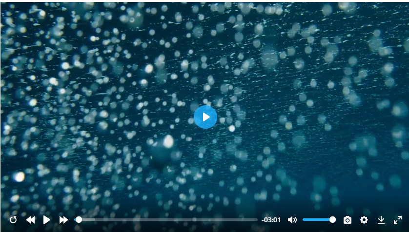

# plyr-plugin-capture
a capture plugin of plyr player

[demo](https://zengde.github.io/plyr-plugin-capture/)



# Use
1.use modern browser 

2.add plyr-plugin-capture.js after main plyr js
```html
<script src="path/to/plyr.js"></script>
<script src="path/to/plyr-plugin-capture.js"></script>
<script>
    const player = new Plyr('#player');
</script>
```

3.add capture to controls and capture label to i18n
```
// your other configs
controls: [
    // your other controls
    'capture'
],
i18n:{
    // your other i18n
    capture: '截图'
}
```

4.click   to download capture image